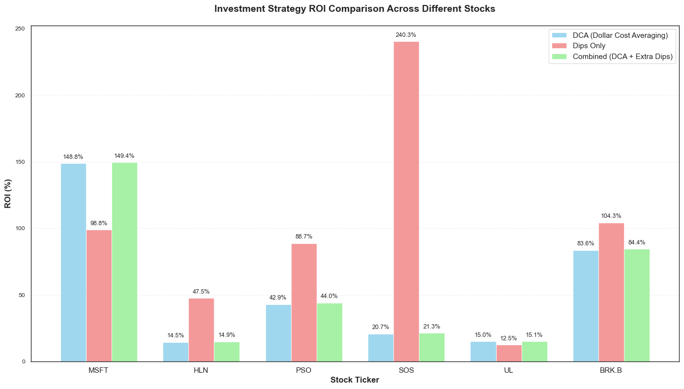

# Should you buy the dip?

## Table of Contents

- [Introduction](#introduction)
- [Strategies](#strategies)
  - [Dollar Cost Averaging (DCA)](#dollar-cost-averaging-dca)
  - [Only Buying The Dip (OBTD)](#only-buying-the-dip-obtd)
  - [Combining Dollar Cost Averaging and Buying The Dip (DCA+BTD)](#combining-dollar-cost-averaging-and-buying-the-dip-dcabtd)
- [Results](#results)

## Introduction

In this repository, we backtest a "buying the dip" (BTD) strategy to determine whether long term investors benefit from buying the dip. We compare buying the dip to Dollar Cost Averaging (DCA), another very common investment strategy among long-term retail investors.

The motivation behind this backtest, is that theoretically, there should be almost no advantage to buying the dip. If the stock market is at least weakly efficient, the movement of a stock's price stems from new public information. Therefore, the expected return of a stock with or without a dip should be the same, since it would only depend on future public information, unavailable at the time of purchase.

On the other hand, we can also expect institutional investors to overreact to negative news, or miss important nuance published later, meaning the price of the stock will be adjusted in the following days. Hence backtesting both a BTD and a DCA strategy gives insight into how efficient the market is, and if buying the dip is useful for long-term, mostly passive investors.

## Strategies

### Dollar Cost Averaging (DCA)

DCA is a very common strategy among long-term passive investors. The idea is to invest a fix amount of cash into an asset at regular intervals, independently on the market's movement. For example, an investor could commit to invest $\$x$ into the S&P500 at the end of every month.

This strategy smooths out the gains and the losses. As it name implies, it averages out the average buying price of the stock, decreasing volatility, and hence risk, of the investor's position.

### Only Buying The Dip (OBTD)

To measure the effetiveness of buying the dip, we first develop a strategy where we only buy a stock whenever it dips. We define a _dip_ in the stock when the daily log return falls below the $2\sigma$ range for the daily log returns.

Specifically, given daily stock prices $p_0, p_1, ..., p_n$, we calculate the log return: $r_i = \log(\frac{p_i}{p_{i-1}})$ for all $i \ge 1$.

The mean of the log return is given by:

$$\bar r = \frac{1}{n}\sum\limits_{i=1}^n{r_i}$$

And the standard deviation of the log return is defined as:

$$\sigma = \sqrt{\frac{1}{n}\sum\limits_{i=1}^n{(r_i-\bar r)^2}}$$

We then create a sequence of days $d_1, d_2, ..., d_m$ of log losses outside the $2\sigma$ range, in other words, $r_{d_i} < \bar r - 2\sigma$ for $1\le i \le m$

The OBTD strategy consists of investing $\$x$ into the asset on the dip days $d_1, d_2, ..., d_m$

### Combining Dollar Cost Averaging and Buying The Dip (DCA+BTD)

To test a more realistic strategy in which the investor buys every dip, we backtest a strategy that mixes DCA with BTD. Indeed, long-term investments don't necessarily wait for a dip, but rather invest in a stock, and simply invest a higher amount when a dip occurs.

For this DCA+BTD strategy, we simply invest $\$x$ into the asset every day, and an additional $\$x$ on "dip days", as defined in the previous part

## Experiment

We collect daily data for the following stocks, from January 2018 to August 2025:

- Microsoft (\$MSFT)
- Haleon (\$HLN)
- Pearson (\$PSO)
- SOS Limited (\$SOS)
- Unilever (\$UL)
- Berkshire Hathaway (\$BRK.B)

The investment amount, for both the dip days, and regular days, is $\$10$.

We then measure the return on investment (ROI) defined as:

$$
\text{ROI} = \frac{\text{Final total value of portfolio} - \text{Total amount invested}}{\text{Total amount invested}}
$$

## Results

Results TBA soon

Key insights on the analysis for these 5 stocks:

1. **SOS shows exceptional performance with the "Dips Only" strategy** (240.34% ROI), suggesting it had particularly dramatic dips that provided excellent buying opportunities.

2. **MSFT demonstrates that DCA can be very effective** for stable, growing stocks (148.77% ROI), and the combined strategy barely improves upon it.

3. **For most stocks, the Combined strategy provides the best risk-adjusted returns** by maintaining consistent investment while capitalizing on dips.

4. **UL shows that some stocks perform poorly regardless of strategy**, indicating the importance of stock selection over timing strategy.

5. **BRK.B and PSO show cases where "buying the dip" significantly outperforms DCA**, suggesting these stocks had pronounced cyclical patterns.

### Note on SOS Limited

It seems that the price data for SOS Limited has errors, since the BTD strategy performs has a much higher ROI than both the DCA and combined strategy. After further investigation, it seems that the price data provided by AlphaVantage is incorrect, as whon in the figure below:

# Conclusion

Overall, this backtest suggests that buying the dip can add value in certain markets, hinting at mild inefficiencies likely driven by short‑term overreaction to negative news or underreaction to positive news. That said, timing is inconsistent and stock‑specific, so for long‑term passive investors, straightforward DCA remains the most reliable and low‑risk baseline. A practical compromise is to keep DCA as the core and selectively add on perceived overreactions, with conservative sizing and clear limits. Results are data‑ and period‑dependent, so broader samples, longer horizons, and trading frictions should be evaluated before generalizing.

# Further work

I am aiming to perform deeper analysis on the returns for each strategy, calculating the Sharpe ratio, average log return, and the standard deviation of the log returns, to extract more information on the risk of each strategy.
